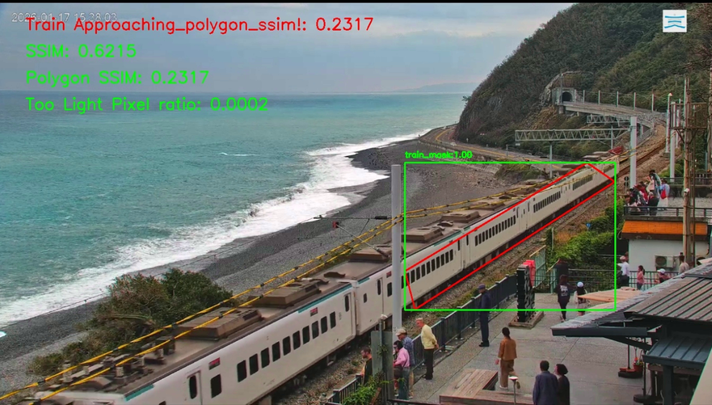

# Introduction-台東多良車站火車偵測系統
本專案是來偵測台東多良車站的火車何時出現在畫面中, 方便觀察有哪些種類的火車。以及發現在youtube上有網友整理的火車時刻表, 將來或許可以取代他們。讓喜歡火車的網友可以根據時間去進行回放，以及觀察到有部分火車沒有出現在時刻表上！

台東多良車站即時影像 Taitung Duoliang Station Live Camera
https://www.youtube.com/watch?v=UCG1aXVO8H8

本次挑戰在RaspberryPi上面運作, 所以嘗試使用傳統影像。

本專案使用docker環境下確定可以在x86與raspberrypi 4上面正常運行



## 如何安裝與使用
### 方法1: docker啟動服務
```
$xhost + #開啟xhost權限, 讓opencv視窗可以從docker內部開啟
$docker compose up -d
```

### 方法2:使用python安裝

#### youtube轉rtsp服務
透過mediamtx、yt-dlp服務將youtube串流轉成rtsp，方便opencv進行讀取。並且配合systemctl讓服務可以自動重啟，避免死掉
```
#從yt-dlp github上下載執行檔, 並且放在docker資料夾中
官網: https://github.com/yt-dlp/yt-dlp/releases/latest/download/

從mediamtx官方網站下載mediamtx檔案, 並且放在docker資料夾中
官網: https://github.com/bluenviron/mediamtx/releases/tag/v1.15.6

進入到docker資料夾內部運行mediamtx, p.s須確保與mediamtx.yml在同一層目錄下
$cd docker
$mediamtx
```


#### 辨識服務
安裝辨識環境
```
# 建立虛擬環境
$pip3 install virtualenv
$virtualenv venv
$source ./venv/bin/activate

# 安裝辨識所需環境
$source ./venv/bin/activate
$pip3 install docker/requirements.txt
```

開啟辨識服務
```
$source ./venv/bin/activate
$python3 main.py
```

## 系統說明
1. 透過yt-dlp將youtube直播轉成串流, 並且透過mediamtx輸出成rtsp串流供opencv使用
2. opencv讀取mediamtx輸出的串流
3. 透過EMA_BackgroundModel建立畫面背景圖
4. 使用SSIM演算法比較background_frame與 frame的差異, 判斷出在指定polygon區域中是否有變化
5. 若變化超過一定的門檻值認為是有火車, 否則視為正常。 會進行連續判斷並且挑選變化最大的圖片作為火車圖片。 並且判斷圖片中的區域是否過亮, 若過亮被排除在計算相似度分數的範圍外。


## TODO:
- [x] 根據觀察誤報大部分都在ssim>0.7情況下
    - 因此調低conf.simm_threshold到0.7-->有效果
- [x] mediamtx撥放youtube每4~5個小時就會斷線
    - 在mediamtx.yml中加入以下參數試試-->有效果
        ```
        runOnInitRestart: yes
        ```
- [] 解決晚上的時候因為汽車大燈造成指定區域中SSIM變化過大的問題
- [x] 將background與train分開, 都存在output_root下面
    - background: output_root/background
    - train: output_root/train
    - train_ori: output_root/train_ori(暫時不用train_ori)


## 參考資料:
多良車站班次:
https://fullfenblog.tw/2016-08-14-628/#%E5%A4%9A%E8%89%AF%E8%BB%8A%E7%AB%99%EF%BD%9C%E6%9C%80%E6%96%B0%E7%81%AB%E8%BB%8A%E9%80%9A%E8%A1%8C%E6%99%82%E5%88%BB%E8%A1%A8


Frigate_移動物體與偵測的作法

https://docs.frigate-cn.video/frigate/video_pipeline#%E8%A7%86%E9%A2%91%E6%B5%81%E7%A8%8B%E8%AF%A6%E8%BF%B0

可參考這一段程式:https://github.com/blakeblackshear/frigate/blob/b1a5896b537cad54fe13bf7090b082d0214be44e/frigate/motion/frigate_motion.py#L70-L132

